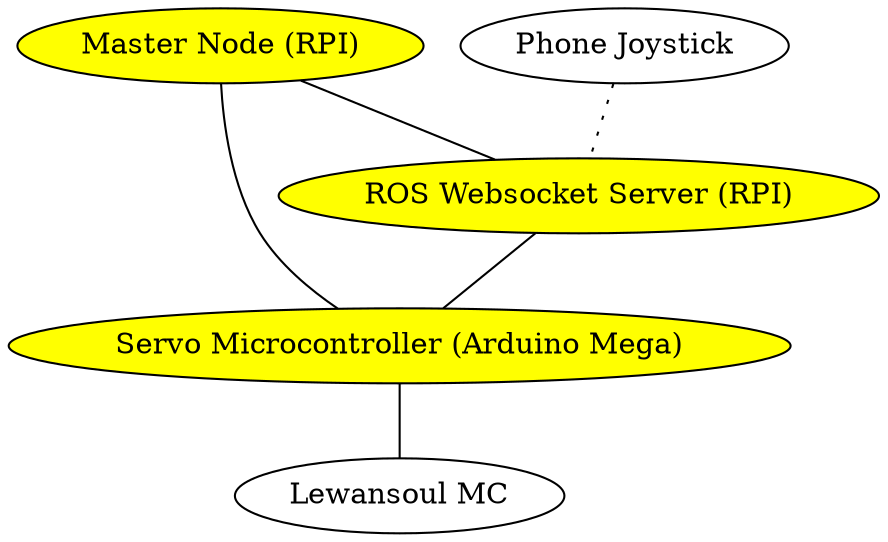

+++
title = "Robot Operating System (ROS)"
author = ["Jethro Kuan"]
lastmod = 2020-05-31T01:09:17+08:00
draft = false
+++

## Introduction to ROS {#introduction-to-ros}

### What is ROS? <a id="b049e1028daa027cae7888fe4de0456c" href="#nilil_ros_introd_ros_wiki">(nil, nil)</a> {#what-is-ros}

<!--list-separator-->

- Left :B_column:

  - Meta-operating system, providing low level services:
    - process communication over a network
    - device control
    - hardware abstraction
  - Distributed framework of processes

<!--list-separator-->

- Right :B_column:

  

### Why use ROS? {#why-use-ros}

- "Lightweight" framework that speeds up large-scale robotic
  development
- Many libraries developed on top of this framework that can be
  reused:
  - Physics simulation ([Gazebo](http://gazebosim.org/))
  - Movement + Navigation ([ROS navigation](http://wiki.ros.org/navigation))

### ROS Concepts {#ros-concepts}

<!--list-separator-->

- Computational Graph

  - All computation is organized as a peer-to-peer network of communicating
    processes.

<!--list-separator-->

- Nodes

  - Processes that perform any form of computation.
  - Nodes can communicate with one another.
  - Example of nodes:
    - Publish sensor readings
    - Receiving teleop commands and running them
  - Written with ROS client libraries ([rospy](http://wiki.ros.org/rospy), [roscpp](http://wiki.ros.org/roscpp))

<!--list-separator-->

- Master (Primary) Node

  - Provides name registration, node lookup to all nodes in the
    computational graph.
  - Enables communication between nodes.

<!--list-separator-->

- Parameter Server

  - "Distributed" key-value store: all nodes can access data stored in
    these keys.

<!--list-separator-->

- Topics

  - Nodes communicating via the publish-subscribe semantics do so by
    publishing and subscribing to topics.
  - Every topic has a name, e.g. `/sensors/temp1`
  - No access permissions

<!--list-separator-->

- Services

  - Request-response semantics (think Web servers)
  - Requests are blocking

### Example Computational Graph {#example-computational-graph}



## Getting Started With ROS {#getting-started-with-ros}

### ROS Environment Setup {#ros-environment-setup}

Here I assume you have the ROS environment set up. If not, see [the
appendix](#ros-installation).

### Creating a ROS Workspace {#creating-a-ros-workspace}

Catkin is ROS' package manager, built on top of CMake.

```bash
  mkdir -p ~/catkin_ws/src        # Create the directories
  cd ~/catkin_ws/                 # Change to the directory
  catkin_make                     # Initial setup
```

### Exploring ROS shell commands [^fn:1] {#exploring-ros-shell-commands}

<!--list-separator-->

- rospack

  `rospack find` locates ROS packages.

  ```bash
    rospack find roscpp # /opt/ros/melodic/share/roscpp
  ```

<!--list-separator-->

- roscd

  roscd changes you to the directory of the ros package.

  ```bash
    roscd roscpp
    pwd # /opt/ros/melodic/share/roscpp
  ```

### Creating a ROS package {#creating-a-ros-package}

We use the convenience script `catkin_create_pkg` to instantiate our package.

```bash
  cd ~/catkin_ws/src
  catkin_create_pkg workshop std_msgs rospy roscpp
  # Created file workshop/CMakeLists.txt
  # Created file workshop/package.xml
  # Created folder workshop/include/workshop
  # Created folder workshop/src
  # Successfully created files in /home/jethro/catkin_ws/src/workshop. Please adjust the values in package.xml.
```

### What's in a ROS package? {#what-s-in-a-ros-package}

```text
  workshop
      CMakeLists.txt          # Build instructions
      include                 # For cpp deps, if any
         workshop
      package.xml             # Details about the package
      src                     # Contains source code
```

### Starting ROS {#starting-ros}

We initialize the ROS master node with `roscore`.

```bash
  roscore

  # ...
  # process[master]: started with pid [16206]
  # ROS_MASTER_URI=http://jethro:11311/

  # setting /run_id to 05bf8c5e-efed-11e9-957b-382c4a4f3d31
  # process[rosout-1]: started with pid [16217]

```

To kill it, press `Ctrl-C` in the same terminal.

### ROS Nodes {#ros-nodes}

<!--list-separator-->

- rosnode

  rosnode let's us inspect available nodes:

  ```bash
    rosnode list                    # /rosout
    rosnode info /rosout
  ```

  What happens if master is not running?

  ```bash
    rosnode list               # ERROR: Unable to communicate with master!
  ```

<!--list-separator-->

- Running a ROS node

  A ROS package may contain many ROS nodes.

  ```bash
    rosrun turtlesim <TAB>
    # draw_square        mimic              turtlesim_node     turtle_teleop_key
  ```

  ```bash
    rosrun turtlesim turtlesim_node
    # [ INFO] [1571214245.786246078]: Starting turtlesim with node name /turtlesim
    # [ INFO] [1571214245.790986159]: Spawning turtle [turtle1] at x=[5.544445], y=[5.544445], theta=[0.000000]
  ```

  Exercise: reinspect the node list.

### ROS Topics {#ros-topics}

Now we have a visual simulation of a turtle. How do we make it move?

```bash
rosrun turtesim turtle_teleop_key
```

<!--list-separator-->

- What's going on?

  - `turtle_teleop_key` advertises on a ROS topic, and publishes each keystroke:

   <!--listend-->

  ```bash
    rostopic list
    rostopic echo /turtle1/cmd_vel
  ```

<!--list-separator-->

- ROS Messages

  - ROS messages are pre-defined formats. They are binarized and
    compressed before they are sent over the wire.

   <!--listend-->

  ```bash
    rostopic type /turtle1/cmd_vel   # geometry_msgs/Twist
  ```

<!--list-separator-->

- Monitoring the Topic

  - The rate at which messages is published is good to monitor (in Hz).
  - A topic that has too many messages can get congested, and buffer/drop
    many messages, or congest the ROS network.

   <!--listend-->

  ```bash
    rostopic hz /turtle1/cmd_vel
    # subscribed to [/turtle1/cmd_vel]
    # average rate: 13.933
    # min: 0.072s max: 0.072s std dev: 0.00000s window: 2
  ```

<!--list-separator-->

- Rosbag

  - A bag is subscribes to one or more topics, and stores serialized
    data that is received (for logging/replay)

   <!--listend-->

  ```bash
    rosbag record /turtle1/cmd_vel
    # [ INFO] [1571294982.145679913]: Subscribing to /turtle1/cmd_vel
    # [ INFO] [1571294982.168808833]: Recording to 2019-10-17-14-49-42.bag
  ```

### ROS Services {#ros-services}

- Services allow request-response interactions between nodes.

<!--listend-->

```bash
rosservice list
rosservice call /clear
rosservice type /spawn | rossrv show
```

### ROS Params {#ros-params}

the `rosparams` commandline interface allows us to store and manipulate
data on the ROS Parameter server.&nbsp;[^fn:2]

```bash
  rosparam set            # set parameter
  rosparam get            # get parameter
  rosparam load           # load parameters from file
  rosparam dump           # dump parameters to file
  rosparam delete         # delete parameter
  rosparam list           # list parameter names
```

## Pubsub <a id="0eb03dca701c737878a6bf71343edd56" href="#wiki_pubsub">(nil, nil)</a> {#pubsub}

### When do we use topics? {#when-do-we-use-topics}

Previously we looked at ready-made ROS packages and how they used
topics and services. Now, we'll write our own publisher and
subscriber.

The pubsub interface is useful in situations where a response for each
request is not required:

- Sensor readings
- Log info

### A Simple Publisher {#a-simple-publisher}

We use `rospy`, but `roscpp` is fine as well. We create a new file in our
workshop package `workshop/src/talker.py`:

```python
  #!/usr/bin/env python
  import rospy
  from std_msgs.msg import String

  pub = rospy.Publisher('my_topic', String, queue_size=10) # initializes topic
  rospy.init_node('talker', anonymous=True) # required to talk to Master

  while not rospy.is_shutdown():
      pub.publish("Hello")
```

### Executing the Publisher Node {#executing-the-publisher-node}

We need to make our Python file executable:

```bash
  chmod +x talker.py
```

```bash
  rosrun workshop talker.py
```

Exercise: monitor the output. What's wrong? (hint: Hz)

### Setting the rate of publishing {#setting-the-rate-of-publishing}

We use the `Rate` object, and the `rate.sleep()` to set the rate of
publishing:

```python
  rate = rospy.Rate(10)           # 10 hz
  # ...
  rate.sleep()
  # ...
```

### Good Practice {#good-practice}

We often wrap all our logic in a function, and catch the
`ROSInterruptException` exception:

```python
  #!/usr/bin/env python
  import rospy
  from std_msgs.msg import String

  def talker():
      pub = rospy.Publisher('my_topic', String, queue_size=10) # initializes topic
      # ...

  try:
      talker()
  except rospy.ROSInterruptException:
      pass
```

### Exercise: Write a time publisher (5 minutes) {#exercise-write-a-time-publisher--5-minutes}

Goal: publish the current date-time onto a topic `/datetime.`

Hint: Python has a `datetime` library.

### Subscriber {#subscriber}

We create a listener in `workshop/src/listener.py`

```python
  #!/usr/bin/env python
  import rospy
  from std_msg.msg import String

  def echo(data):
      print(data.data)

  def listener():
      rospy.init_node("listener", anonymous=True)
      rospy.Subscriber("my_topic", String, echo)
      rospy.spin() # prevents python from exiting

  listener()
```

### Summary {#summary}

```python
  rospy.init_node(name)           # create node
  rospy.Publisher(topic_name, msg_type) # create publisher
  rospy.Subscriber(topic_name, msg_type, callback) # create subscriber
  rospy.Rate(10)                  # rate object
  rospy.spin()                    # spin
```

## Services <a id="d9f8b17a885ac23c956840df53cacd3f" href="#wiki_service">(nil, nil)</a> {#services}

### Msg and Srv {#msg-and-srv}

msg
: message files that define the format of a ROS message. These
generate source code for different languages (think Apache Thrift,
Protobuf).

srv
: describes a service (request/response)

### Creating a msg {#creating-a-msg}

```bash
mkdir -p workshop/msg
```

Create a file `workshop/msg/Num.msg:`

```text
  int64 num
```

### Compiling the msg {#compiling-the-msg}

In `package.xml`:

```xml
  <build_depend>message_generation</build_depend>
  <exec_depend>message_runtime</exec_depend>
```

In CMakeLists.txt:

```text
  find_package(catkin REQUIRED COMPONENTS
     roscpp
     rospy
     std_msgs
     message_generation
  )

  catkin_package(
    ...
    CATKIN_DEPENDS message_runtime ...
    ...)

  add_message_files(
    FILES
    Num.msg
  )

  generate_messages()
```

Compile the message:

```bash
  cd ~/catkin_ws
  catkin_make
  catkin_make install
  # ...
  # [100%] Built target workshop_generate_messages_cpp
  # [100%] Built target workshop_generate_messages_py
  # [100%] Built target workshop_generate_messages_eus
  # Scanning dependencies of target workshop_generate_messages
  # [100%] Built target workshop_generate_messages
```

### Using the ROS msg {#using-the-ros-msg}

```bash
  rosmsg list                     # ... workshop/Num
  rosmsg show workshop/Num        # int64 num
```

### Creating a ROS srv {#creating-a-ros-srv}

```bash
mkdir -p workshop/srv
```

In `workshop/srv/SumInts.srv`:

```text
  int64 a
  int64 b
  ---
  int64 sum
```

### Compiling the ROS srv {#compiling-the-ros-srv}

Since srv files are also compiled, the setup is [similar to compiling msgs](#compiling-the-msg).

### Writing a Service Node {#writing-a-service-node}

We can create a server that uses the service file we defined earlier:

```python
  #!/usr/bin/env python
  from workshop.srv import SumInts, SumIntsResponse
  import rospy

  def handler(req):
      return SumIntsResponse(req.a + req.b)

  def sumints_server():
      rospy.init_node("sumints_server")
      s = rospy.Service("sumints", SumInts, handler)
      rospy.spin()

  sumints_server()
```

### Writing a Client {#writing-a-client}

```python
  #!/usr/bin/env python
  import sys
  import rospy
  from workshop.srv import SumInts

  def sumints_client(x, y):
      rospy.wait_for_service('sumints')
      try:
          sumints = rospy.ServiceProxy('sumints', SumInts)
          resp1 = sumints(x, y)
          return resp1.sum
      except rospy.ServiceException, e:
          print "Service call failed: %s"%e

  x = int(sys.argv[1])
  y = int(sys.argv[2])
  print "%s + %s = %s"%(x, y, sumints_client(x, y))
```

```bash
  rosrun workshop sumint_client.py 1 2
  # 1 + 2 = 3

```

### Exercise: Time Service (15 minutes) {#exercise-time-service--15-minutes}

Write a service that:

- requests nothing
- responds with the current time

Write a client that sends the request and prints this response.

## What's Next? {#what-s-next}

### What's Next? {#what-s-next}

- Run a simulator, model the robot using URDF
- Look at community ROS packages
  - **tf2:** maintain robotic coordinate frames (pose estimation)
  - **gmapping/slam etc.:** navigation
- Look at ROS 2

## Appendix {#appendix}

### Common Pitfalls {#common-pitfalls}

1.  Not sourcing your `devel/setup.bash`:

<!--listend-->

```bash
  source devel/setup.bash
```

1.  This is necessary to make available all the C++ and python ROS
    packages that you have built
2.  I recommend using [direnv](https://direnv.net/), and sourcing it every time you enter
    the Catkin workspace.

### ROS Installation {#ros-installation}

<!--list-separator-->

- Ubuntu

  Follow the instructions on ROS Wiki. <a id="74cf41bb1b0292dffcecca4fe9f40ef7" href="#nilil_instal_ubunt_ros_wiki">(nil, nil)</a>

<!--list-separator-->

- VM

  [Download the VM image](https://drive.google.com/file/d/1SFU4rhWyAd2mlmDAIh0pvXkOvpxO5QuT/view) and load it.

## References {#references}

# Bibliography

<a id="nilil_ros_introd_ros_wiki" target="_blank">nil, _ROS/Introduction - ROS wiki_, , _()_, (nil). </a> [↩](#b049e1028daa027cae7888fe4de0456c)

<a id="wiki_pubsub" target="_blank">nil, _ROS/Tutorials/WritingPublisherSubscriber(python) - ROS wiki_, , _()_, (nil). </a> [↩](#0eb03dca701c737878a6bf71343edd56)

<a id="wiki_service" target="_blank">nil, _ROS/Tutorials/WritingServiceClient(python) - ROS wiki_, , _()_, (nil). </a> [↩](#d9f8b17a885ac23c956840df53cacd3f)

<a id="nilil_instal_ubunt_ros_wiki" target="_blank">nil, _Melodic/Installation/Ubuntu - ROS wiki_, , _()_, (nil). </a> [↩](#74cf41bb1b0292dffcecca4fe9f40ef7)

[^fn:1]: Almost all these commands have tab completion!
[^fn:2]: can also be done programatically
